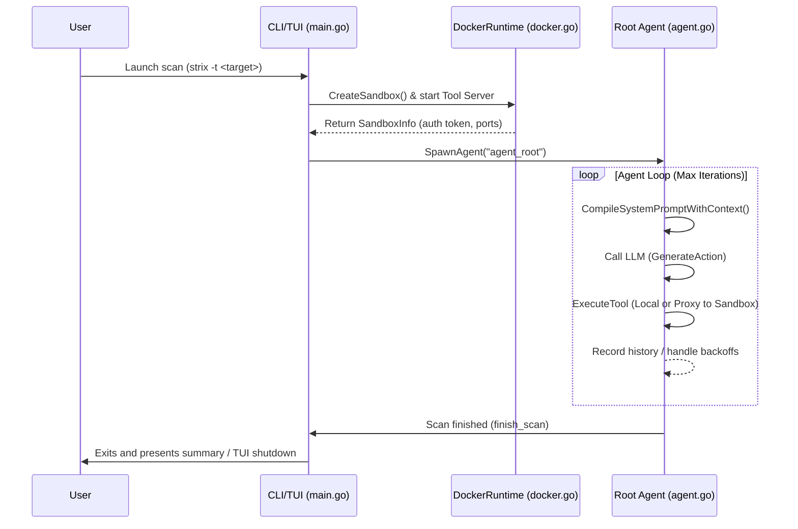
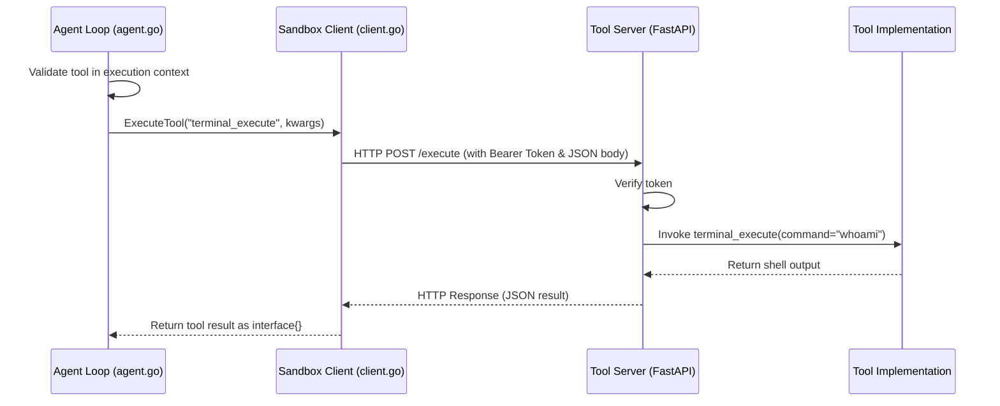
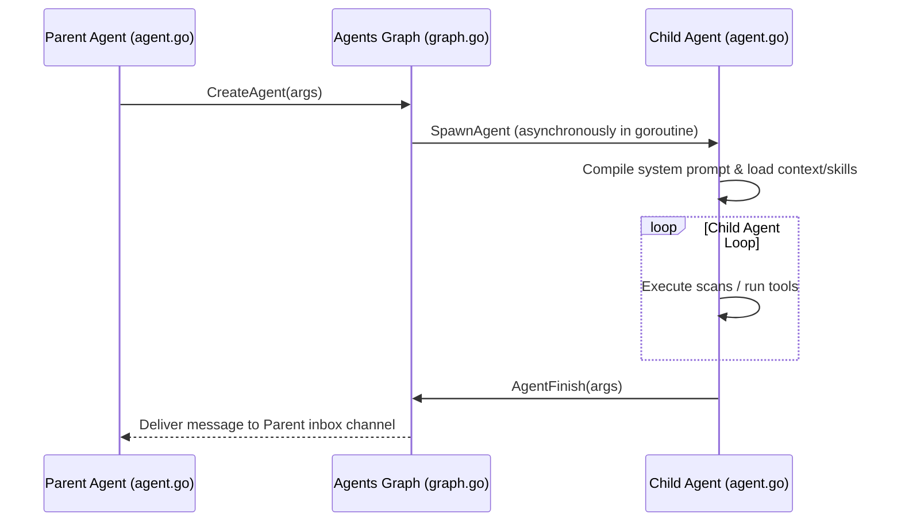

# Strix Go Port Architecture

Strix is an autonomous, multi-agent security pentesting framework designed to discover, validate, and remediate application vulnerabilities. The Go port (`strix-go`) is a highly concurrent, context-aware Go implementation of the Strix agent reasoning engine and tool orchestrator. It executes security scanning loops, coordinates agent delegation graphs, and bridges to isolated, Docker-based sandboxes where security tools run.

This document details the architectural layout, core components, and data flows of the Go-based Strix system.

---

## High-Level System Architecture

The Go port separates agent coordination and reasoning (running on the host using `langchaingo` and Charm Bubbletea UI) from tool execution (running inside Docker sandbox containers).

```mermaid
graph TD
    subgraph Host Machine (Go Orchestrator)
        UI[User Interface: Bubbletea TUI/CLI Log] --> main["CLI Entry (cmd/strix/main.go)"]
        main --> AgentLoop["Agent Loop (pkg/agents/agent.go)"]
        AgentLoop --> LLM["LLM Client (pkg/llm/ using langchaingo)"]
        AgentLoop --> Registry["Tool Registry (pkg/tools/registry.go)"]
    end

    subgraph Secure Sandbox (Docker Container)
        Registry -- HTTP /execute API (pkg/runtime/client.go) --> ToolServer["Tool Server (FastAPI /execute)"]
        ToolServer --> Tools["Security Tools: terminal_execute, python_action, etc."]
        Tools --> OS["Sandbox OS (Kali Linux utilities)"]
        Tools --> Playwright["Browser Instance (Playwright)"]
        Tools --> Caido["HTTP Proxy (Caido GraphQL)"]
        Tools --> Workspace["Target Code Workspace"]
    end

    Registry -- Parent Context Tools --> LocalTools["pkg/tools: notes, todo, agents_graph, thinking, reporting"]
```

---

## Core Components

The Go port codebase is structured under the `strix-go` directory:

### 1. User Interface & CLI Entry
- **Location**: [cmd/strix](file:///home/mfranz/github/strix-goclient/strix-go/cmd/strix) & [pkg/interface](file:///home/mfranz/github/strix-goclient/strix-go/pkg/interface)
- **Primary Files**:
  - [main.go](file:///home/mfranz/github/strix-goclient/strix-go/cmd/strix/main.go): Entry point for the Go command-line tool. Uses `cobra` to parse arguments (targets, scan modes, custom instructions), handles system signals, registers tools, loads tool XML schemas, and boots the CLI/TUI.
  - [log_handler.go](file:///home/mfranz/github/strix-goclient/strix-go/pkg/interface/log_handler.go): Manages multi-layered logging outputs. Directs CLI logs and agent interactions into structured files (`strix.log`, `agent.log`).
  - [tui.go](file:///home/mfranz/github/strix-goclient/strix-go/pkg/interface/tui.go): An interactive terminal UI built using Charm's `bubbletea`, `lipgloss`, and Glamour markdown rendering. It visualizes the active agents graph, task todo lists, vulnerability notes, and live execution logs in non-blocking background snapshots.

### 2. Agent Runtime & Execution Loop
- **Location**: [pkg/agents](file:///home/mfranz/github/strix-goclient/strix-go/pkg/agents)
- **Primary Files**:
  - [agent.go](file:///home/mfranz/github/strix-goclient/strix-go/pkg/agents/agent.go): Declares the core `Agent` struct and execution loop. Implements reasoning cycles, context-aware prompt building, XML-based tool call routing, exponential backoff/delay schedules for API retries, and failure loop detection (repeating identical tool errors).

### 3. Language Model Integration
- **Location**: [pkg/llm](file:///home/mfranz/github/strix-goclient/strix-go/pkg/llm)
- **Primary Files**:
  - [llm.go](file:///home/mfranz/github/strix-goclient/strix-go/pkg/llm/llm.go): Adapts the agent engine to LLMs via the `langchaingo` library. Supports Google AI (Gemini), OpenAI, Azure OpenAI, and Amazon Bedrock ([bedrock.go](file:///home/mfranz/github/strix-goclient/strix-go/pkg/llm/bedrock.go)).
  - [prompt.go](file:///home/mfranz/github/strix-goclient/strix-go/pkg/llm/prompt.go): Dynamically compiles Jinja-like system prompts containing current targets, guidelines, target scopes, and execution contexts.

### 4. Sandbox Isolation Runtime
- **Location**: [pkg/runtime](file:///home/mfranz/github/strix-goclient/strix-go/pkg/runtime)
- **Primary Files**:
  - [docker.go](file:///home/mfranz/github/strix-goclient/strix-go/pkg/runtime/docker.go): Manages the lifecycle of isolated Docker containers (`ghcr.io/usestrix/strix-sandbox`). Handles pulling images, container creation via Docker API (`github.com/docker/docker/client`), file copying, and dynamic port bindings for Tool Server and Caido.
  - [client.go](file:///home/mfranz/github/strix-goclient/strix-go/pkg/runtime/client.go): Exposes an HTTP client that communicates with the FastAPI-based Tool Server inside the container using token authentication, proxying tool execution requests (`/execute`).

### 5. Context-Aware Tool Registry
- **Location**: [pkg/tools](file:///home/mfranz/github/strix-goclient/strix-go/pkg/tools)
- **Primary Files**:
  - [registry.go](file:///home/mfranz/github/strix-goclient/strix-go/pkg/tools/registry.go): Registers and validates tools. Reads XML schemas (`*_schema.xml`) to build XML prompt declarations. Filters and exposes tools according to the current execution context to prevent sandbox-bound agents from seeing host-only actions.
- **Tool Packages**:
  - [graph.go](file:///home/mfranz/github/strix-goclient/strix-go/pkg/tools/agents_graph/graph.go): Implements multi-agent spawning, message passing via Go channel inboxes, dependency tracking, and graph visualization.
  - [notes.go](file:///home/mfranz/github/strix-goclient/strix-go/pkg/tools/notes/notes.go): Manages wiki notes and vulnerability documentation. (Registered as `create_note`, `update_note`, etc.)
  - [todo.go](file:///home/mfranz/github/strix-goclient/strix-go/pkg/tools/todo/todo.go): Manages checklist steps. (Registered as `create_todo`, `update_todo`, etc.)
  - [reporting.go](file:///home/mfranz/github/strix-goclient/strix-go/pkg/tools/reporting/reporting.go): Creates final vulnerability report objects. (Registered as `create_vulnerability_report`, etc.)
  - [thinking.go](file:///home/mfranz/github/strix-goclient/strix-go/pkg/tools/thinking/thinking.go): Exposes structured chain-of-thought blocks. (Registered as `think`.)
  - [finish.go](file:///home/mfranz/github/strix-goclient/strix-go/pkg/tools/finish/finish.go): Concludes the active scanning sequence. (Registered as `finish_scan`.)

---

## Detailed Data Flows

### 1. Security Scan Lifecycle



### 2. Sandbox Tool Execution

When an agent calls a sandbox-bound tool (e.g., `terminal_execute` or `python_action`):



### 3. Agent Delegation (Graph of Agents)

When an agent needs to delegate a task to a specialized agent (e.g., code review):



---

## Directory Organization Reference

```
strix-go/
├── bin/                    # Compiled binaries
├── cmd/
│   └── strix/
│       └── main.go         # CLI Entry & Cobra setup
├── pkg/
│   ├── agents/
│   │   ├── agent.go        # Main agent struct & execution loop
│   │   └── agent_test.go   # Agent execution tests
│   ├── interface/
│   │   ├── log_handler.go  # File and console logger handlers
│   │   └── tui.go          # Bubbletea terminal UI
│   ├── llm/
│   │   ├── bedrock.go      # Bedrock client adaptor
│   │   ├── llm.go          # Langchaingo LLM initializer
│   │   ├── prompt.go       # Context-aware system prompt compiler
│   │   └── utils.go        # JSON & token helpers
│   ├── runtime/
│   │   ├── client.go       # Sandbox Tool Server HTTP client
│   │   └── docker.go       # Docker container runtime driver
│   └── tools/
│       ├── agents_graph/   # Multi-agent graph & communication tools
│       ├── finish/         # Finish scan utility
│       ├── notes/          # Wiki/notes manager
│       ├── reporting/      # Vulnerability findings generator
│       ├── thinking/       # Chain-of-thought helper
│       ├── todo/           # Checklist tracker
│       ├── registry.go     # Context-aware XML schema & tool registry
│       └── registry_test.go# Schema loading tests
└── go.mod                  # Go module dependencies
```

---

## Execution Context Isolation

The Go port implements strict **Execution Context Isolation** to ensure LLM agent stability:

- **Host (Parent) Context**: Used by the main orchestrator and agents that do not run security commands directly. These agents have access to parent-only tools:
  - `load_skill`
  - `web_search`
  - `create_agent` / `send_message_to_agent` / `wait_for_message`
  - `create_todo` / `update_todo`
  - `create_note` / `update_note`
  - `reporting` / `finish`
- **Sandbox Context**: Used by agents executing code and commands on targets (e.g., executing Python script payloads, terminal commands, or browser automation). To prevent models from attempting unavailable host actions, their system prompts are dynamically filtered using `tools.GetToolsPromptForContext(ExecutionContextSandbox)`, providing visibility into sandbox-bound tools only:
  - `terminal_execute`
  - `python_action`
  - `browser_action`
  - `str_replace_editor` / `list_files` / `search_files`

Before routing any tool command, the executor verifies the capability using `ValidateToolCallInContext`, rejecting misrouted execution requests immediately on the host.

---

## Agent-Level Review Mode

The Go port features an interactive **Agent-Level Review Mode** controlled via the `--review-agents` CLI flag. When enabled:
- The execution automatically defaults to non-interactive console mode (`-n`), redirecting standard input/output streams for operator control.
- Spawning delegation (`CreateAgent`) and task completion (`AgentFinish`) requests are intercepted on the host:
  - **Spawning Revisions**: The operator can approve the sub-agent task, reject it (returning custom instructions/errors to the parent agent), or edit the task guidelines.
  - **Rework Enforcement**: On task completion, the operator can approve the reported findings or request rework. Rejecting completion returns custom feedback as a tool error, keeping the sub-agent active and instructing it to perform additional steps.
- Stdin prompts are serialized across concurrent sub-agents using a global `StepReviewMutex`.

