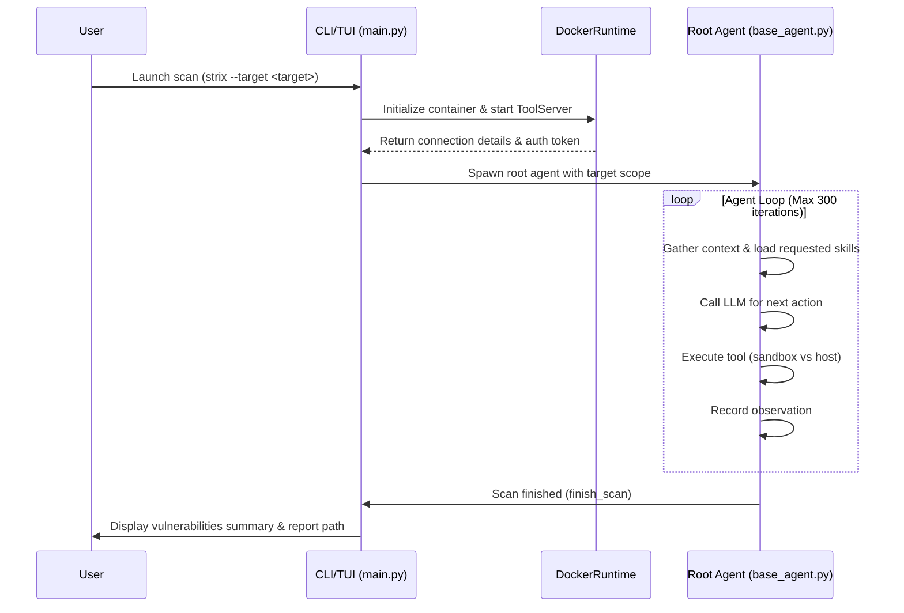
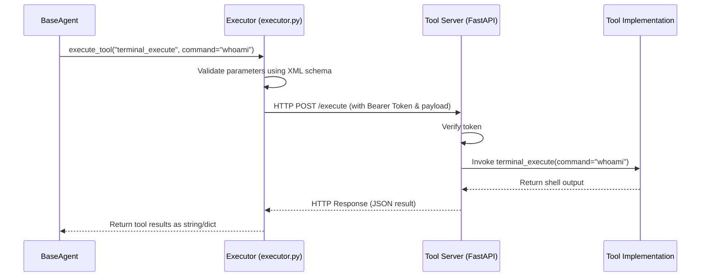
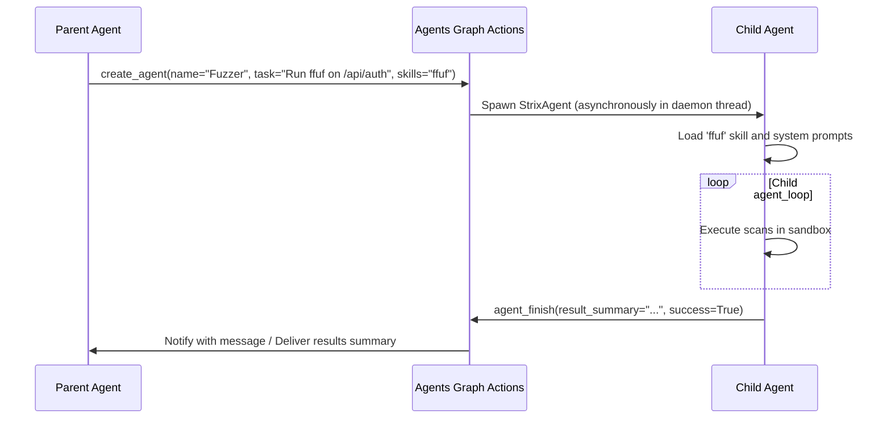

# Strix System Architecture

Strix is an autonomous, multi-agent security pentesting framework designed to discover, validate, and remediate application vulnerabilities. It operates by coordinating specialized AI agents that execute dynamic and static security analysis workflows inside a secure sandbox.

This document details the architectural layout, core components, and data flows of the Strix system.

---

## High-Level System Architecture

Strix separates agent reasoning and coordination (which runs on the host machine with access to LLM APIs) from security tool execution (which runs inside isolated Docker-based sandboxes).

```mermaid
graph TD
    subgraph Host Machine (Orchestrator)
        UI[User Interface: TUI/CLI] --> main["CLI Entry (main.py)"]
        main --> Tracer["Telemetry & Tracer"]
        main --> AgentLoop["Agent Runtime (base_agent.py)"]
        AgentLoop --> LLM["LLM Client (LiteLLM)"]
        AgentLoop --> Executor["Tool Executor (executor.py)"]
    end

    subgraph Secure Sandbox (Docker Container)
        Executor -- HTTP /execute API --> ToolServer["Tool Server (tool_server.py)"]
        ToolServer --> Tools["Security Tools: terminal_execute, python_action, etc."]
        Tools --> OS["Sandbox OS (Kali Linux utilities)"]
        Tools --> Playwright["Browser Instance (Playwright)"]
        Tools --> Caido["HTTP Proxy (Caido GraphQL)"]
        Tools --> Workspace["Target Code Workspace"]
    end

    Executor -- Local Tools --> LocalTools["Shared Memory, Wiki Notes, Todo Lists"]
```

---

## Core Components

Strix is organized into modular packages under the [strix/](file:///home/mfranz/github/strix/strix) directory:

### 1. User Interface & CLI Entry
- **Location**: [strix/interface/](file:///home/mfranz/github/strix/strix/interface)
- **Primary Files**:
  - [main.py](file:///home/mfranz/github/strix/strix/interface/main.py): CLI/TUI entry point, arguments parser, environment validation, targets identification, and Docker image initialization.
  - [cli.py](file:///home/mfranz/github/strix/strix/interface/cli.py): Live CLI display parser. Handles non-interactive CI/CD runs.
  - [tui.py](file:///home/mfranz/github/strix/strix/interface/tui.py): Interactive Textual TUI. Visualizes the multi-agent graph, terminal outputs, and live vulnerability findings.

### 2. Agent Runtime & Core Loop
- **Location**: [strix/agents/](file:///home/mfranz/github/strix/strix/agents)
- **Primary Files**:
  - [base_agent.py](file:///home/mfranz/github/strix/strix/agents/base_agent.py): Holds the main execution loop ([BaseAgent](file:///home/mfranz/github/strix/strix/agents/base_agent.py#L49)). Processes iterations, manages state, invokes LLM, parses tool invocations, handles user cancellations, and monitors iteration limits.
  - [StrixAgent/strix_agent.py](file:///home/mfranz/github/strix/strix/agents/StrixAgent/strix_agent.py): Specialization subclass. Builds target scanning scopes (repositories, codebases, web targets) and handles standard/quick scan modes.
  - [state.py](file:///home/mfranz/github/strix/strix/agents/state.py): Manages agent memory, conversation history, actions taken, observations, error logging, and wake-up notifications.

### 3. Language Model Interface
- **Location**: [strix/llm/](file:///home/mfranz/github/strix/strix/llm)
- **Primary Files**:
  - [llm.py](file:///home/mfranz/github/strix/strix/llm/llm.py): Handles interaction with LiteLLM, Jinja system prompt compilation, reasoning configuration (`STRIX_REASONING_EFFORT`), and response formatting.
  - [memory_compressor.py](file:///home/mfranz/github/strix/strix/llm/memory_compressor.py): Truncates and compresses long agent logs/histories to fit context limits.
  - [dedupe.py](file:///home/mfranz/github/strix/strix/llm/dedupe.py): Detects duplicate vulnerabilities using semantic LLM evaluations to prevent redundant reports.

### 4. Sandbox Isolation Runtime
- **Location**: [strix/runtime/](file:///home/mfranz/github/strix/strix/runtime)
- **Primary Files**:
  - [docker_runtime.py](file:///home/mfranz/github/strix/strix/runtime/docker_runtime.py): Pulls the target sandbox Docker image, runs the container, configures network port forwards (Caido, Playwright, Tool Server), and mounts directories.
  - [tool_server.py](file:///home/mfranz/github/strix/strix/runtime/tool_server.py): A FastAPI-based HTTP server executing inside the Docker container. Exposes the `/execute` endpoint to run sandbox-bound tools.

### 5. Extensible Tools Registry
- **Location**: [strix/tools/](file:///home/mfranz/github/strix/strix/tools)
- **Primary Files**:
  - [registry.py](file:///home/mfranz/github/strix/strix/tools/registry.py): Provides the `@register_tool` decorator. Parses XML tool schemas (`*_schema.xml`) to inject clear instructions and XML parameters format into the LLM system prompt.
  - [executor.py](file:///home/mfranz/github/strix/strix/tools/executor.py): Decides whether to run tools locally on the host machine or proxy them inside the sandbox container.
- **Available Tool Modules**:
  - [agents_graph/](file:///home/mfranz/github/strix/strix/tools/agents_graph): Multi-agent management ([create_agent](file:///home/mfranz/github/strix/strix/tools/agents_graph/agents_graph_actions.py#L384), [send_message_to_agent](file:///home/mfranz/github/strix/strix/tools/agents_graph/agents_graph_actions.py#L496), [agent_finish](file:///home/mfranz/github/strix/strix/tools/agents_graph/agents_graph_actions.py#L567), [wait_for_message](file:///home/mfranz/github/strix/strix/tools/agents_graph/agents_graph_actions.py#L796)).
  - [notes/](file:///home/mfranz/github/strix/strix/tools/notes): Shared wiki memory ([create_note](file:///home/mfranz/github/strix/strix/tools/notes/notes_actions.py#L244), [update_note](file:///home/mfranz/github/strix/strix/tools/notes/notes_actions.py#L391), etc.).
  - [todo/](file:///home/mfranz/github/strix/strix/tools/todo): Task checklist tracking ([create_todo](file:///home/mfranz/github/strix/strix/tools/todo/todo_actions.py#L162)).
  - [terminal/](file:///home/mfranz/github/strix/strix/tools/terminal): Executes bash/cli processes inside the sandbox ([terminal_execute](file:///home/mfranz/github/strix/strix/tools/terminal/terminal_actions.py#L7)).
  - [python/](file:///home/mfranz/github/strix/strix/tools/python): Interactive Python sessions inside the sandbox ([python_action](file:///home/mfranz/github/strix/strix/tools/python/python_actions.py#L10)).
  - [file_edit/](file:///home/mfranz/github/strix/strix/tools/file_edit): Handles viewing/editing/searching target source files inside the sandbox.
  - [browser/](file:///home/mfranz/github/strix/strix/tools/browser): Automates Playwright scripts inside the sandbox.
  - [proxy/](file:///home/mfranz/github/strix/strix/tools/proxy): Orchestrates Caido interception, request replay, and HTTPQL.
  - [web_search/](file:///home/mfranz/github/strix/strix/tools/web_search): Queries Perplexity AI for CVE details and exploits.
  - [reporting/](file:///home/mfranz/github/strix/strix/tools/reporting): Creates and validates structured vulnerability findings ([create_vulnerability_report](file:///home/mfranz/github/strix/strix/tools/reporting/reporting_actions.py#L202)).

### 6. Dynamic Skills System
- **Location**: [strix/skills/](file:///home/mfranz/github/strix/strix/skills)
- **Description**: Playbooks written in Markdown. Dynamically injected into the agent system prompt context when starting an agent or loaded at runtime via the `load_skill` tool.
- **Categories**:
  - `vulnerabilities/`: Insecure coding workflows, race conditions, JWT bypasses, injections.
  - `tooling/`: Instructions for running command-line scanners (Nmap, Sqlmap, Nuclei, Semgrep, Ffuf).
  - `protocols/`: GraphQL, WebSocket, OAuth.
  - `reconnaissance/`: Attack surface mapping.

### 7. Telemetry & Tracing
- **Location**: [strix/telemetry/](file:///home/mfranz/github/strix/strix/telemetry)
- **Description**: Tracks token usages, costs, tool execution states, and findings. Logs run data to local JSON logs under `strix_runs/` and reports to PostHog if configured.

---

## Detailed Data Flows

### 1. Security Scan Lifecycle



### 2. Sandbox Tool Execution

When an agent calls a sandbox-bound tool (e.g., `terminal_execute` or `python_action`):



### 3. Agent Delegation (Graph of Agents)

When an agent needs to delegate a task to a specialized agent (e.g., fuzzing or code review):



---

## Directory Organization Reference

```
strix/
├── agents/             # Core Agent framework & Root Agent prompt
│   ├── StrixAgent/     # Standard security agent subclass
│   ├── base_agent.py   # Main Agent Loop executor
│   └── state.py        # Agent memory & history state
├── config/             # User environment settings parser
├── interface/          # User views (Textual TUI, CLI logging)
├── llm/                # LLM interfaces (LiteLLM wrappers, Compressor, Deduplication)
├── runtime/            # Sandbox control (Docker interface, FastAPI tool server)
├── skills/             # Markdown playbooks injected dynamically
├── telemetry/          # Token costs & execution tracing
├── tools/              # Tool registry & individual tool modules
└── utils/              # Path resolving helpers
```
